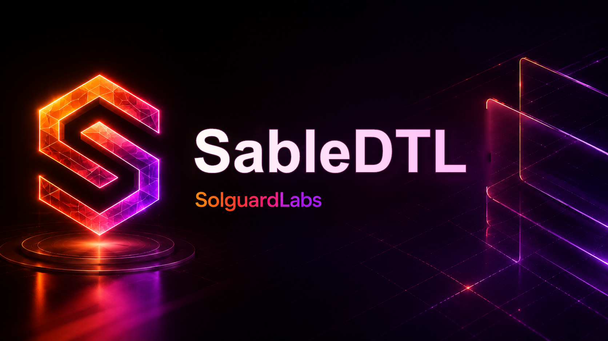

# Sable DTL



Sable DTL es un binario Rust para conciliacion de pagos DTL con facturas,
receipts bancarios, ajustes manuales, claims de settlement y cierre contable por
lote. El proyecto modela un motor operativo determinista pensado para auditoria:
ledger balanceado, estados de factura, reportes de aging, politicas de batch y
escenarios reproducibles desde CLI.

## Componentes Principales

- Facturas con terminos de pago, line items, impuestos y estados de cobro.
- Receipts importados desde ACH, wire, card network, rail digital e interno.
- Ajustes manuales aprobados con politica de basis points y doble aprobacion.
- Ledger con chart of accounts, journal balanceado y trial balance.
- Settlement book con obligaciones, claims, freeze/cancel/settle y clearing.
- Cierre mensual con digest canonico, aging, exposicion y evidencia operativa.
- Catalogo de controles para operaciones de conciliacion y cierre.

## Requisitos

- Rust 1.96 o superior.
- Node.js 20 o superior.

## Uso

Ejecutar el escenario final:

```bash
cargo run --quiet
```

Ejecutar escenarios concretos:

```bash
cargo run --quiet -- valid
cargo run --quiet -- receipts
cargo run --quiet -- adjustments
cargo run --quiet -- monthly-close
cargo run --quiet -- final
```

Cada escenario devuelve un reporte JSON con metricas de facturas, ledger,
settlement, close batch, filas de invoice, filas de claim, eventos y digest
determinista.

## Pruebas

Suite Rust:

```bash
cargo test --locked
```

Suite JavaScript:

```bash
node --test tests/node/*.test.js
```

Suite completa:

```bash
bash scripts/tests.sh
```

Validacion de CI local:

```bash
bash scripts/ci.sh
```

## Estructura

```text
src/
  adjustments/  Ajustes manuales, politica y aplicacion contable.
  amount/       Unidades monetarias, bps, ratios y allocations.
  analytics/    Aging, exposure y statements por contraparte.
  close/        Periodos, close batches y reportes de reconciliacion.
  codec/        JSON canonico y digests Blake3.
  error/        Tipos de error del dominio.
  fixtures/     Estado semilla, catalogos y controles operativos.
  ids/          Tipos fuertes para invoices, receipts, batches y accounts.
  invoice/      Facturas, line items, terminos y libro de invoices.
  ledger/       Chart of accounts, journal y trial balance.
  party/        Contrapartes, roles y cuentas bancarias.
  policy/       Politicas de batch y close.
  receipts/     Receipts de settlement y registro de importacion.
  runtime/      CLI y escenarios reproducibles.
  settlement/   Obligaciones, claims y settlement book.
tests/
  node/         Pruebas de integracion sobre la CLI.
  helpers/      Utilidades de ejecucion de escenarios.
```

## CI

El workflow de GitHub Actions ejecuta:

```bash
cargo fmt --all -- --check
cargo build --all-targets --locked
cargo test --locked
cargo clippy --all-targets --all-features --locked -- -D warnings
node --test tests/node/*.test.js
```

Dependabot cubre Cargo, npm y GitHub Actions.

## Estado del Proyecto

Sable DTL es un laboratorio tecnico para revision de arquitectura y auditoria de
flujos economicos simulados. No debe usarse con fondos reales, claves de
produccion ni infraestructura bancaria sin un proceso formal de hardening,
revision independiente y validacion operacional.
